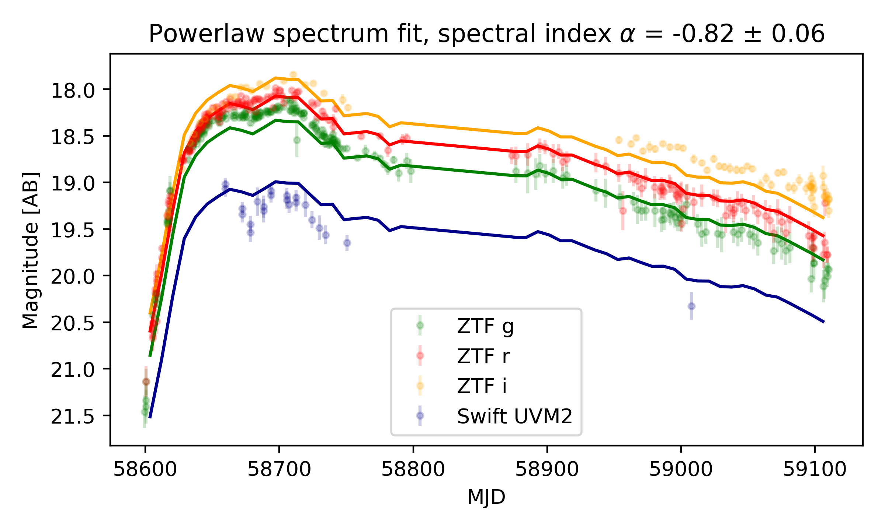

# modelSED

Allows fitting lightcurves with various model spectra. At the moment only power-law and blackbody fits are implemented.

# Installation
Using Pip: ```pip3 install git+https://github.com/simeonreusch/modelsed```

Otherwise, you can clone the repository: ```git clone https://github.com/simeonreusch/modelsed```

# Usage
```python
from modelSED.sed import SED

""" Define the path to the lightcurve you want to model. An example lightcurve is located at:
https://github.com/simeonreusch/modelSED/blob/master/examples/lightcurve.csv
"""

# Now we need to define some parameters
path_to_lightcurve = "example.csv"

# Does the lightcurve have a redshift? Used for luminosity estimates
redshift = 0.266

# How many time bins do we want?
nbins = 60

# Which of the bands do we want to fit?
bands = [
    "P48+ZTF_g",
    "P48+ZTF_r",
    "P48+ZTF_i",
    "Swift+UVM2",
]

# Initialize SED class
sed = SED(
    redshift=redshift,
    fittype=fittype,
    nbins=nbins,
    path_to_lightcurve=path_to_lightcurve,
)

# Perform the global fit
sed.fit_global(bands=bands, plot=False)
sed.load_global_fitparams()

# Perform the fit of each time bin
sed.fit_bins(
    alpha=sed.fitparams_global["alpha"],
    alpha_err=sed.fitparams_global["alpha_err"],
    bands=bands,
    min_bands_per_bin=2,
    verbose=False,
)

# Plot the stuff
sed.load_fitparams()
sed.plot_lightcurve(bands=bands)
sed.plot_luminosity()
```

